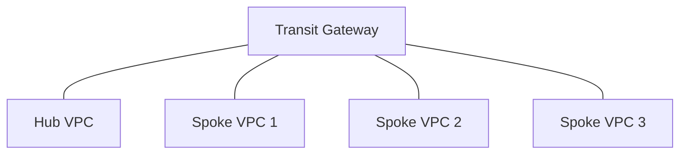
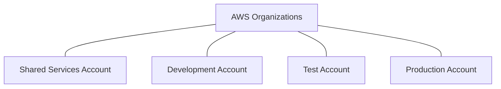
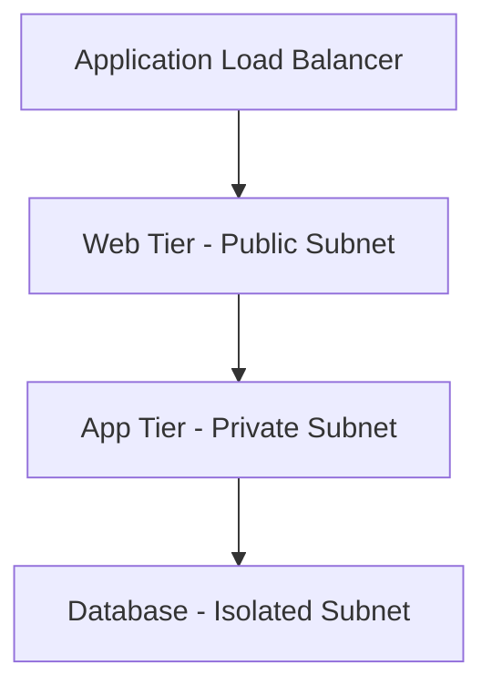
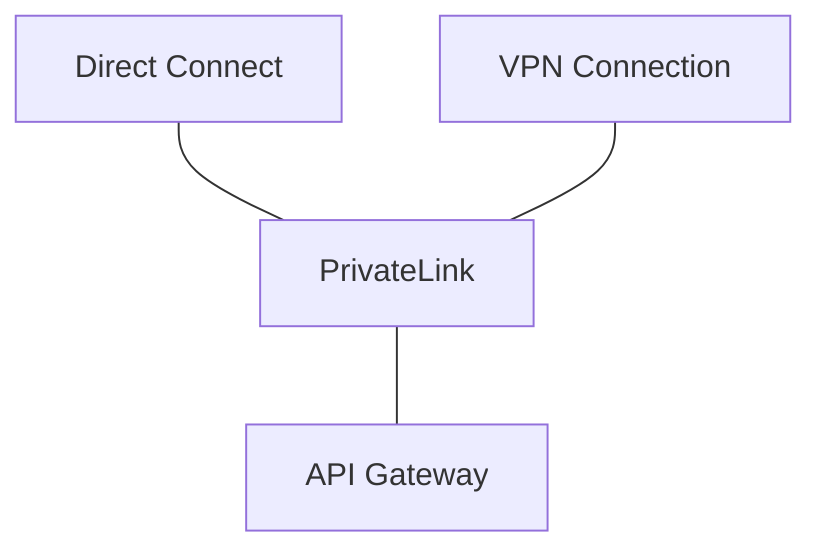
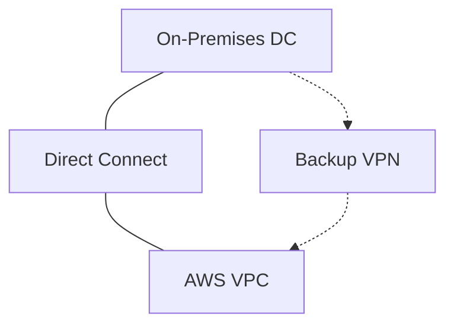
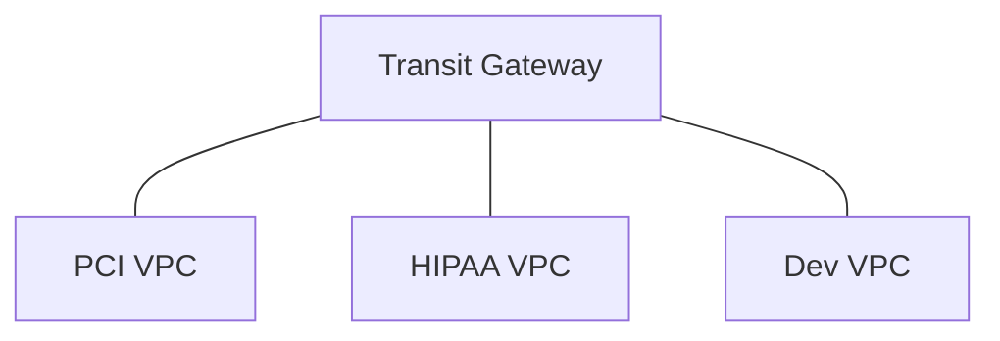
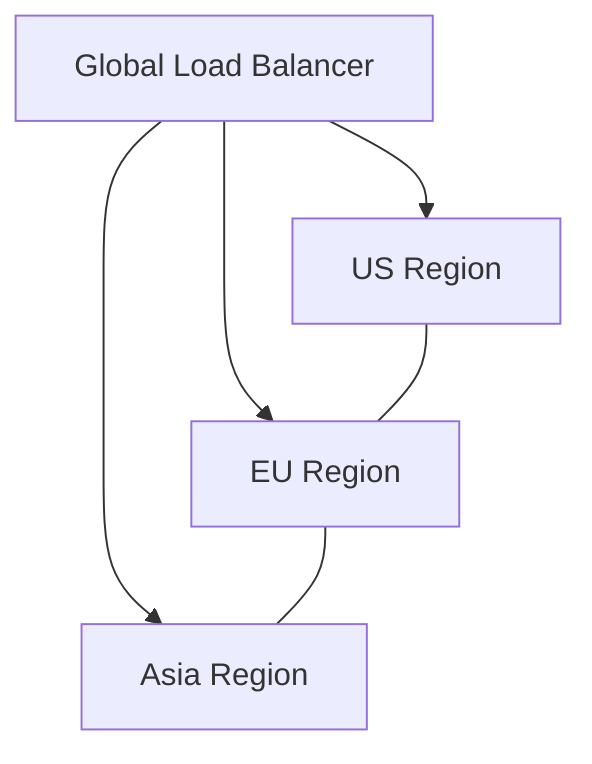
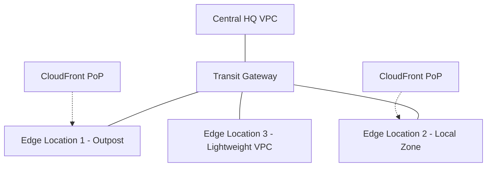

# AWS Network Architecture Patterns

A comprehensive guide to common AWS network architecture patterns, including diagrams and explanations for each pattern.

## Table of Contents
1. [Hub and Spoke Pattern](#1-hub-and-spoke-pattern)
2. [Multi-Account Landing Zone](#2-multi-account-landing-zone)
3. [B2C Application Pattern](#3-b2c-application-pattern)
4. [B2B Integration Pattern](#4-b2b-integration-pattern)
5. [Hybrid Network Pattern](#5-hybrid-network-pattern)
6. [Segmented Network Pattern](#6-segmented-network-pattern)
7. [Multi-Region Pattern](#7-multi-region-pattern)
8. [Edge Network Pattern](#8-edge-network-pattern)

## 1. Hub and Spoke Pattern

**Architecture:**
- Central hub VPC
- Multiple spoke VPCs
- Transit Gateway routing

**Benefits:**
- Centralized management
- Simplified routing
- Cost-effective
- Enhanced security

## 2. Multi-Account Landing Zone

**Architecture:**
- AWS Organizations
- Separate functional accounts
- Shared services

**Benefits:**
- Strong isolation
- Cost tracking
- Compliance control

## 3. B2C Application Pattern

**Architecture:**
- Multi-AZ design
- 3-tier architecture
- Auto-scaling groups

**Benefits:**
- High availability
- Scalability
- Security in depth

## 4. B2B Integration Pattern

**Architecture:**
- Multiple connection types
- Private service access
- API management

**Benefits:**
- Secure partner access
- Service isolation
- Managed connections

## 5. Hybrid Network Pattern

**Architecture:**
- Direct Connect primary
- VPN backup
- DNS integration

**Benefits:**
- High bandwidth
- Low latency
- Redundancy

## 6. Segmented Network Pattern

**Architecture:**
- Isolated compliance VPCs
- Strict access controls
- Limited connectivity

**Benefits:**
- Compliance ready
- Reduced risk
- Clear boundaries

## 7. Multi-Region Pattern

**Architecture:**
- Multiple regions
- Global routing
- Regional resources

**Benefits:**
- Global resilience
- Lower latency
- Disaster recovery

## 8. Edge Network Pattern

**Architecture:**
- Central hub VPC
- Edge location VPCs
- Local compute/caching
- Outpost/Local Zones

**Benefits:**
- Low latency for edge
- Local data processing
- Reduced bandwidth
- Better user experience

## Contributing
Feel free to contribute to this documentation by submitting pull requests or opening issues for improvements.

## License
This documentation is licensed under the MIT License - see the [LICENSE](LICENSE) file for details.
