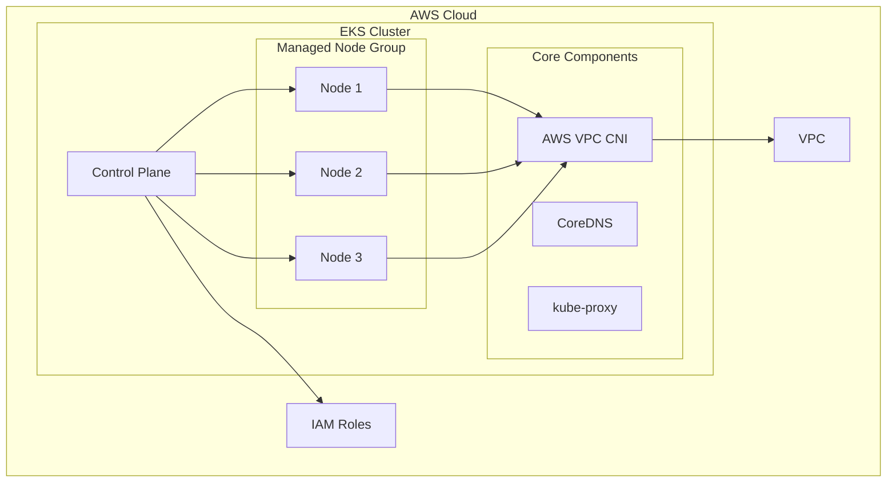
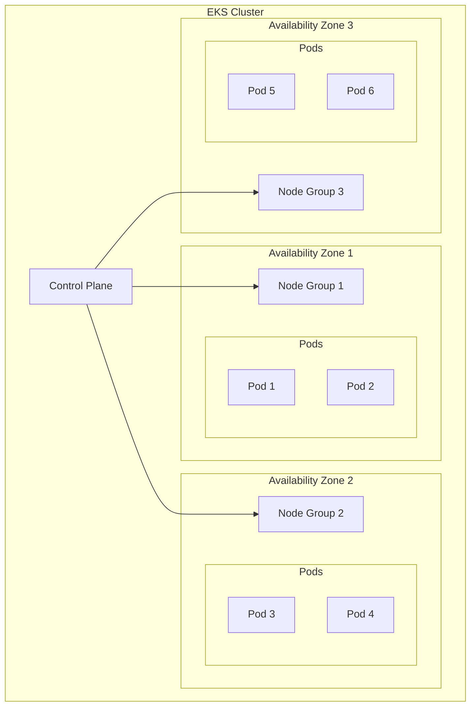
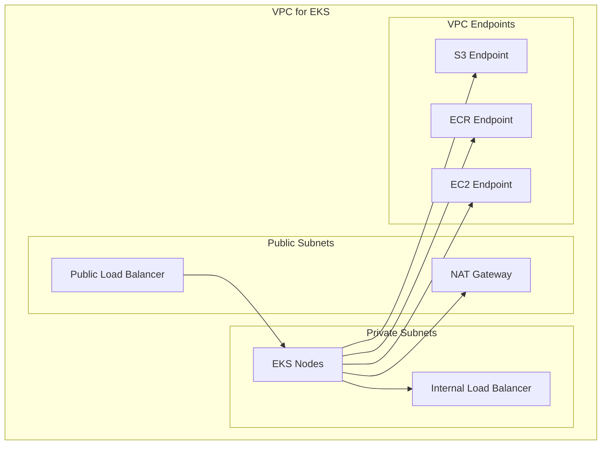
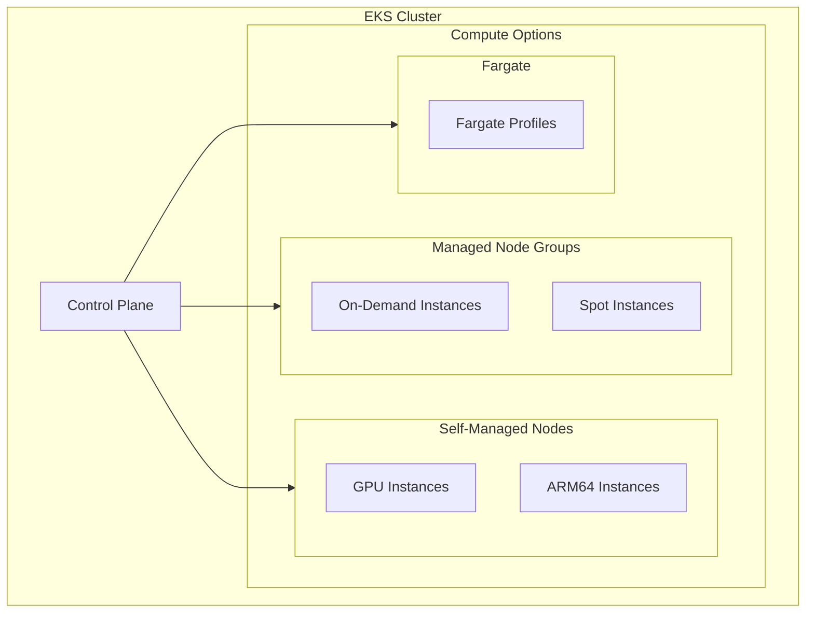
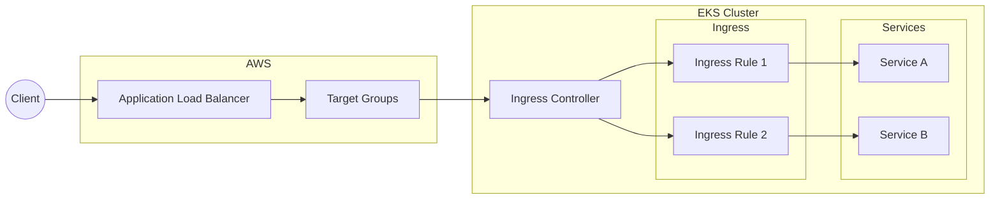
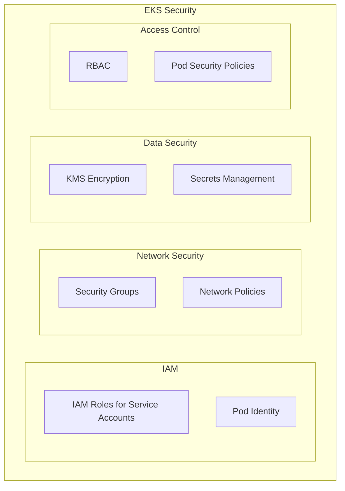
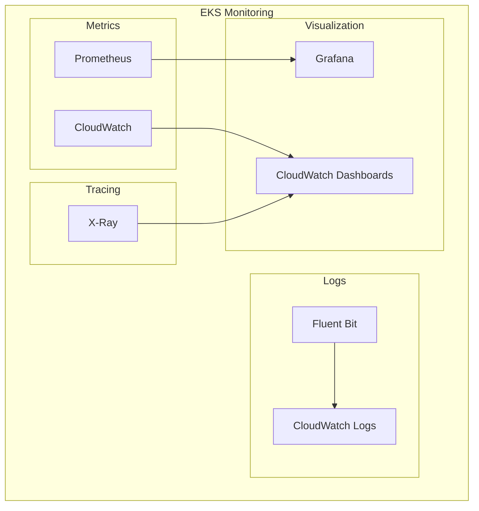
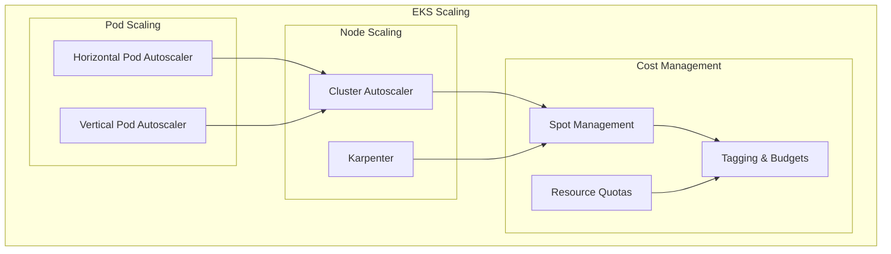

# Amazon EKS Architecture Patterns and Best Practices

A comprehensive guide to Amazon EKS architecture patterns, configurations, and operational best practices.

## Table of Contents
1. [Basic EKS Cluster Setup](#1-basic-eks-cluster-setup)
2. [Multi-AZ EKS Architecture](#2-multi-az-eks-architecture)
3. [VPC and Networking Design](#3-vpc-and-networking-design)
4. [Node Group Patterns](#4-node-group-patterns)
5. [Load Balancer Integration](#5-load-balancer-integration)
6. [Security and IAM](#6-security-and-iam)
7. [Observability Stack](#7-observability-stack)
8. [Scaling and Cost Optimization](#8-scaling-and-cost-optimization)

## 1. Basic EKS Cluster Setup

**Components:**
- EKS Control Plane
- Managed Node Groups
- AWS VPC CNI
- CoreDNS
- kube-proxy

**Best Practices:**
- Use managed node groups
- Enable control plane logging
- Implement proper tagging
- Use latest EKS version

## 2. Multi-AZ EKS Architecture

**Components:**
- Multiple Availability Zones
- Cross-AZ node groups
- Zone-aware scheduling
- Resilient control plane

**Use Cases:**
- High availability workloads
- Production environments
- Fault tolerance requirements

## 3. VPC and Networking Design

**Components:**
- VPC subnets
- Security groups
- NACLs
- VPC endpoints
- AWS Load Balancers

**Network Patterns:**
- Private cluster networking
- Direct connect integration
- VPC peering
- Transit gateway

## 4. Node Group Patterns

**Components:**
- Managed node groups
- Self-managed nodes
- Fargate profiles
- Instance types
- Auto Scaling groups

**Patterns:**
- Workload-specific node groups
- Spot instance usage
- ARM64 nodes
- GPU nodes

## 5. Load Balancer Integration

**Components:**
- AWS Load Balancer Controller
- Application Load Balancer
- Network Load Balancer
- Target Groups
- Ingress resources

**Patterns:**
- ALB Ingress Controller
- NLB Service Controller
- IP-mode targeting
- Instance-mode targeting

## 6. Security and IAM

**Components:**
- IAM roles for service accounts
- Pod security policies
- Security groups
- KMS encryption
- AWS WAF

**Security Patterns:**
- Pod identity
- Network policies
- Secrets management
- Authentication/Authorization

## 7. Observability Stack

**Components:**
- CloudWatch Container Insights
- Prometheus
- Grafana
- Fluent Bit
- X-Ray

**Monitoring Patterns:**
- Metrics collection
- Log aggregation
- Distributed tracing
- Alerts and dashboards

## 8. Scaling and Cost Optimization

**Components:**
- Horizontal Pod Autoscaling
- Cluster Autoscaler
- Karpenter
- Spot Instance management
- Resource quotas

**Optimization Patterns:**
- Right-sizing nodes
- Spot usage strategies
- Cost allocation
- Resource limits

## Best Practices

1. **Cluster Management**
   - Use managed node groups where possible
   - Enable control plane logging
   - Regular version updates
   - Implement proper backup strategy

2. **Security**
   - Use IRSA for pod permissions
   - Implement network policies
   - Enable encryption at rest
   - Regular security audits

3. **Networking**
   - Plan VPC CIDR carefully
   - Use private subnets for nodes
   - Implement proper security groups
   - Consider bandwidth requirements

4. **Cost Optimization**
   - Use Spot Instances where appropriate
   - Implement auto-scaling
   - Monitor resource utilization
   - Use cost allocation tags

## Contributing
Feel free to contribute to this documentation by submitting pull requests or opening issues for improvements.

## License
This documentation is licensed under the MIT License - see the [LICENSE](LICENSE) file for details.
