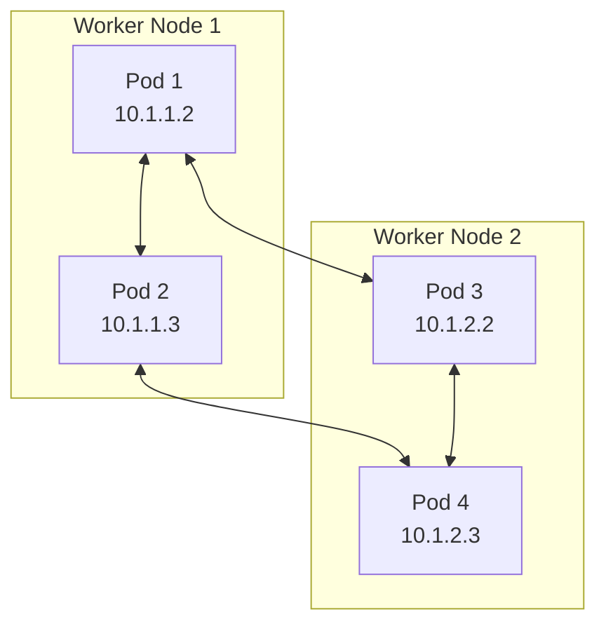
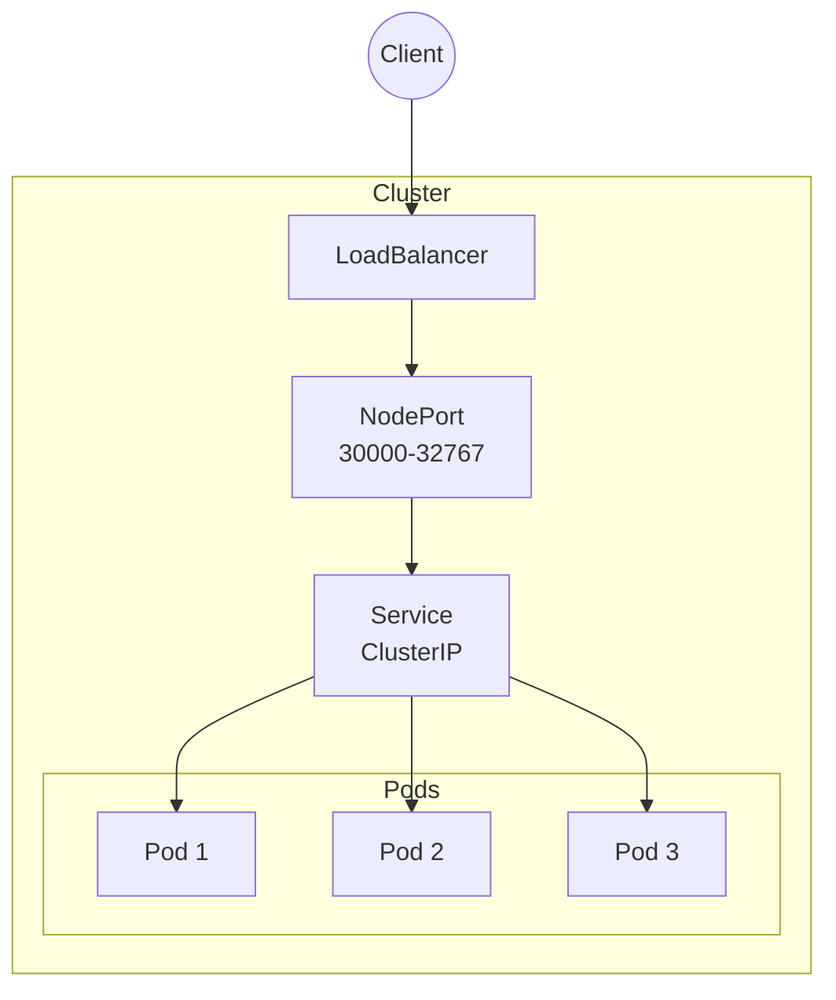
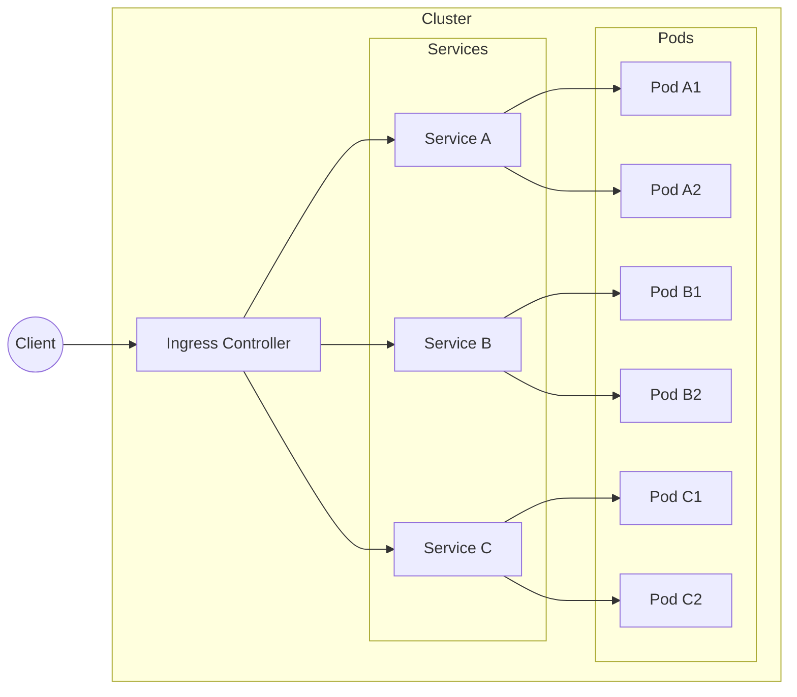
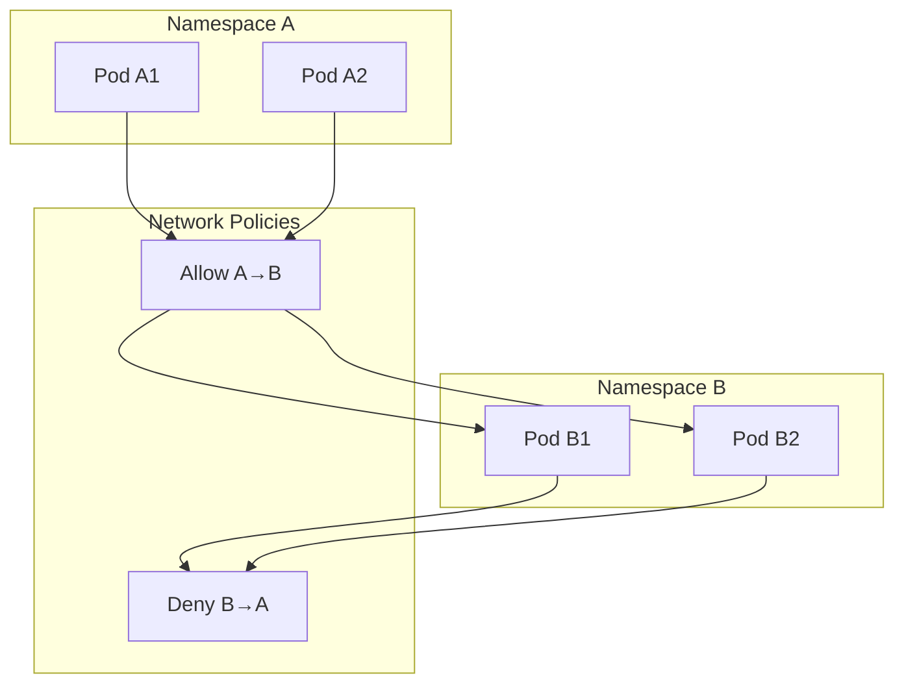
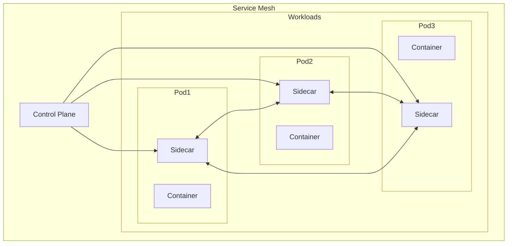
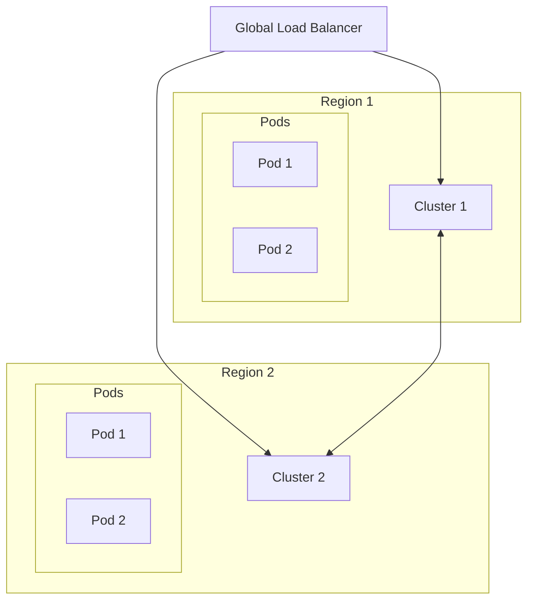
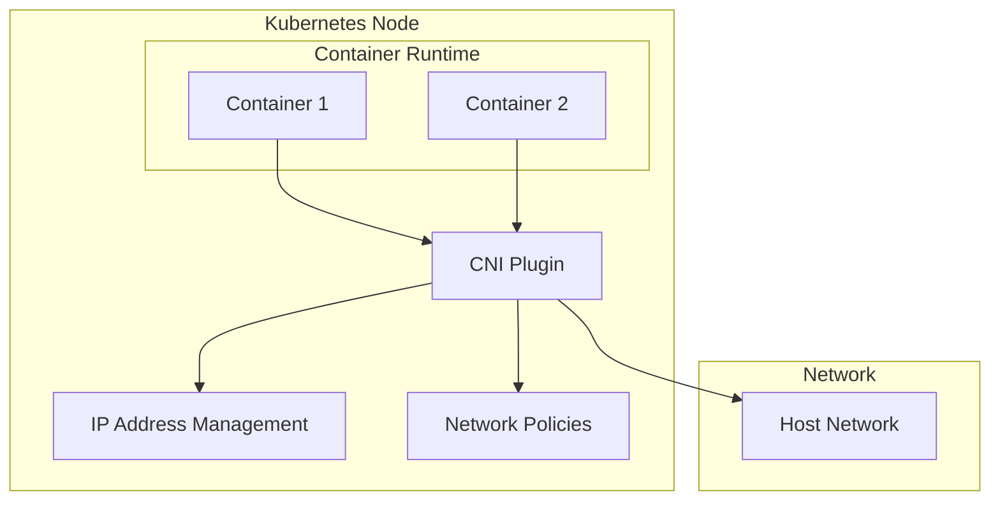
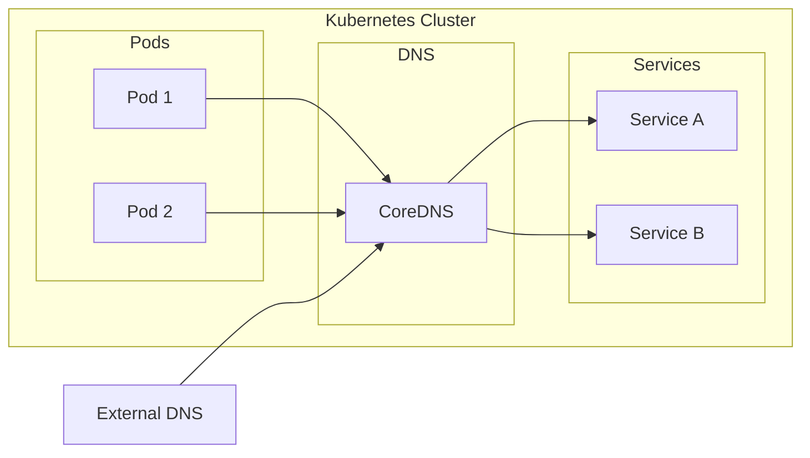

# Kubernetes Networking Patterns and Best Practices

A comprehensive guide to Kubernetes networking patterns, service mesh implementations, and cluster connectivity options.

## Table of Contents
1. [Pod-to-Pod Communication](#1-pod-to-pod-communication)
2. [Service Types and Load Balancing](#2-service-types-and-load-balancing)
3. [Ingress Patterns](#3-ingress-patterns)
4. [Network Policies](#4-network-policies)
5. [Service Mesh Architecture](#5-service-mesh-architecture)
6. [Multi-Cluster Networking](#6-multi-cluster-networking)
7. [CNI Implementation](#7-cni-implementation)
8. [DNS and Service Discovery](#8-dns-and-service-discovery)

## 1. Pod-to-Pod Communication

**Components:**
- Pod network CIDR
- Container Network Interface (CNI)
- Node networking
- Pod IP allocation

**Use Cases:**
- Microservices communication
- Application clustering
- Stateful workloads

## 2. Service Types and Load Balancing

**Components:**
- ClusterIP
- NodePort
- LoadBalancer
- ExternalName
- EndpointSlices

**Use Cases:**
- Internal service discovery
- External access
- Load distribution
- High availability

## 3. Ingress Patterns

**Components:**
- Ingress Controller
- Ingress Rules
- TLS termination
- Path-based routing
- Host-based routing

**Use Cases:**
- HTTP/HTTPS routing
- SSL termination
- Virtual hosting
- URL rewriting

## 4. Network Policies

**Components:**
- Pod selectors
- Namespace selectors
- Ingress rules
- Egress rules
- CIDR blocks

**Use Cases:**
- Security isolation
- Micro-segmentation
- Compliance requirements
- Traffic control

## 5. Service Mesh Architecture

**Components:**
- Sidecar proxies
- Control plane
- Data plane
- Service discovery
- Traffic management

**Use Cases:**
- Observability
- Security
- Traffic control
- Service-to-service communication

## 6. Multi-Cluster Networking

**Components:**
- Cluster federation
- Service discovery
- Cross-cluster communication
- Load balancing

**Use Cases:**
- Geographic distribution
- High availability
- Disaster recovery
- Resource sharing

## 7. CNI Implementation

**Components:**
- Network plugins
- IPAM
- Routes
- Network policies

**Use Cases:**
- Network implementation
- Performance optimization
- Security requirements
- Platform integration

## 8. DNS and Service Discovery

**Components:**
- CoreDNS
- Service records
- Pod DNS policy
- DNS configurations

**Use Cases:**
- Service discovery
- Name resolution
- Custom DNS
- External services

## Best Practices

1. **Network Security**
   - Implement network policies by default
   - Use namespace isolation
   - Enable encryption in transit
   - Follow least privilege principle

2. **Performance**
   - Choose appropriate CNI plugin
   - Optimize MTU settings
   - Monitor network metrics
   - Use endpoint slices

3. **Service Mesh**
   - Start small and scale gradually
   - Monitor resource overhead
   - Implement circuit breakers
   - Use proper timeout configurations

4. **High Availability**
   - Deploy across multiple zones
   - Use proper liveness/readiness probes
   - Implement proper failover mechanisms
   - Monitor network health

## Contributing
Feel free to contribute to this documentation by submitting pull requests or opening issues for improvements.

## License
This documentation is licensed under the MIT License - see the [LICENSE](LICENSE) file for details.
