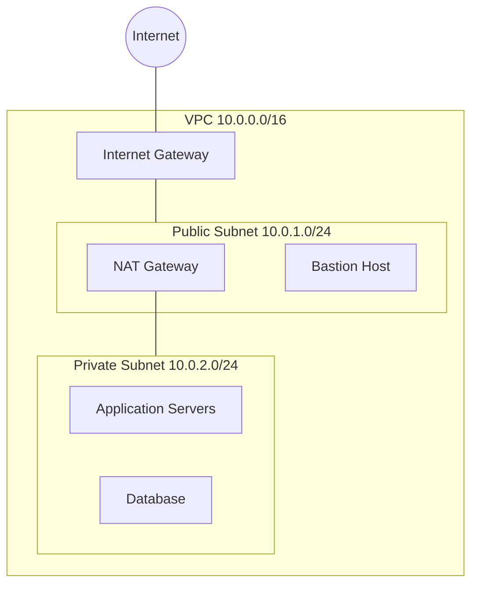
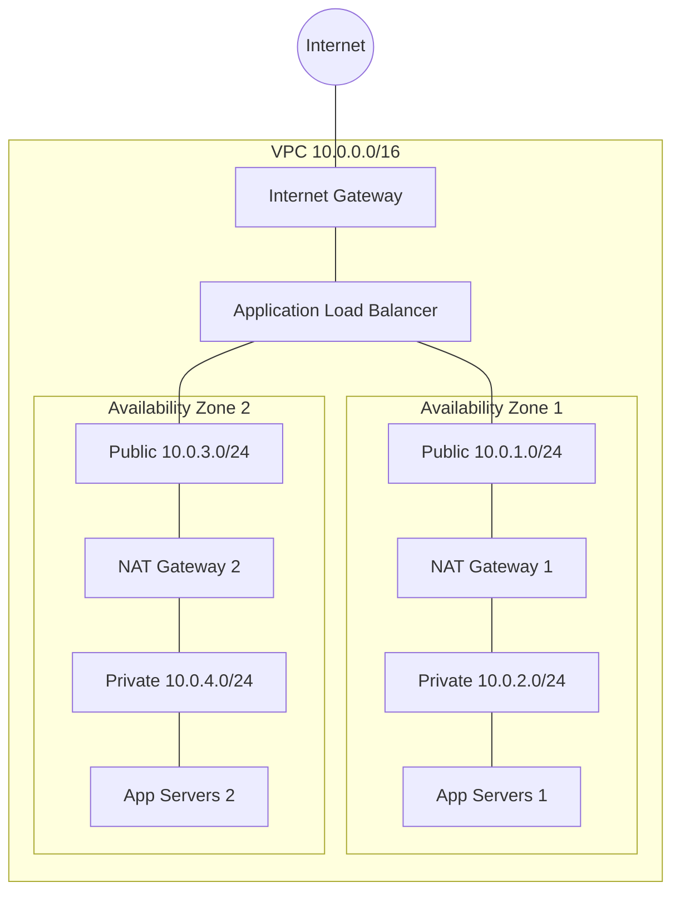
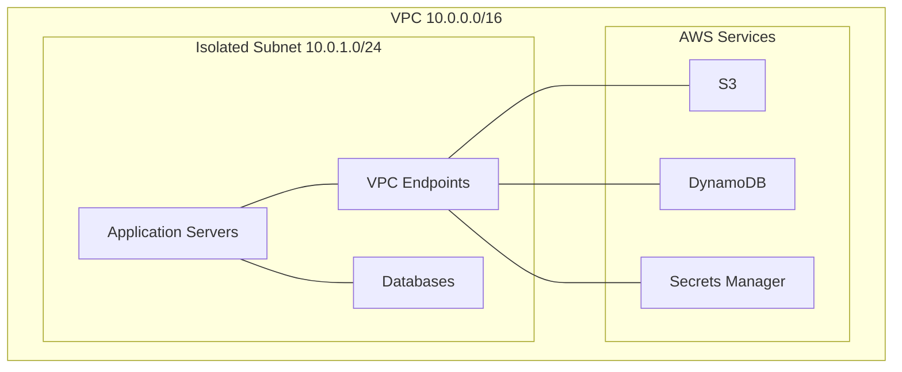
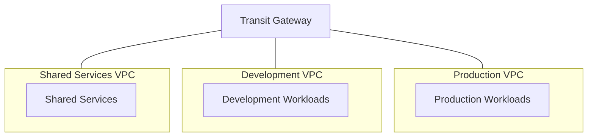
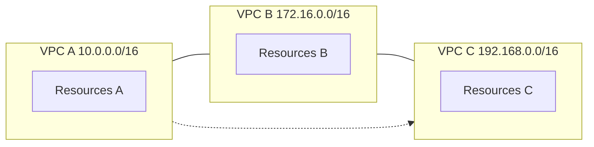
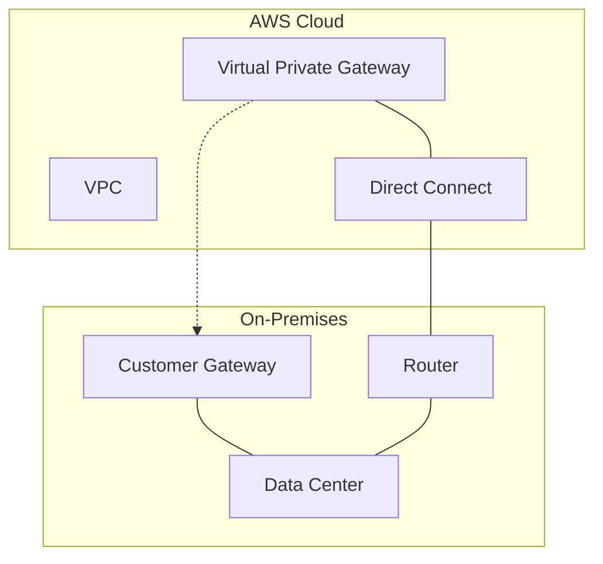
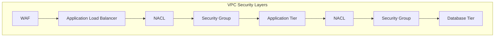
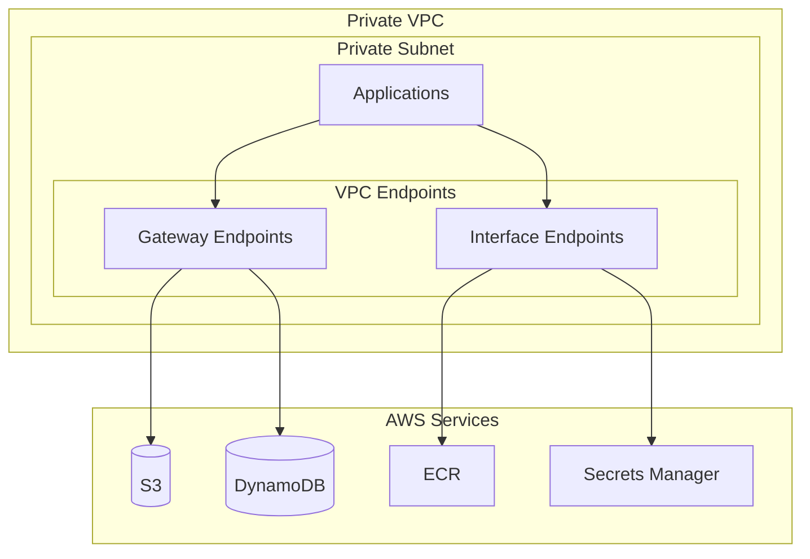

# AWS VPC Networking Patterns and Best Practices

A comprehensive guide to AWS VPC networking patterns, subnet designs, and connectivity options.

## Table of Contents
1. [Basic VPC with Public/Private Subnets](#1-basic-vpc-with-publicprivate-subnets)
2. [Multi-AZ VPC Design](#2-multi-az-vpc-design)
3. [VPC with Isolated Subnets](#3-vpc-with-isolated-subnets)
4. [Transit Gateway Network](#4-transit-gateway-network)
5. [VPC Peering Design](#5-vpc-peering-design)
6. [Hybrid Connectivity](#6-hybrid-connectivity)
7. [Security Layer Design](#7-security-layer-design)
8. [VPC Endpoints Pattern](#8-vpc-endpoints-pattern)

## 1. Basic VPC with Public/Private Subnets

**Components:**
- Public subnets with Internet Gateway
- Private subnets with NAT Gateway
- Route tables for each subnet type
- Network ACLs and Security Groups

**Use Cases:**
- Web applications
- Basic two-tier architectures
- Development environments

## 2. Multi-AZ VPC Design

**Components:**
- Subnets in multiple Availability Zones
- Redundant NAT Gateways
- Cross-AZ load balancing
- Fault-tolerant design

**Use Cases:**
- Production workloads
- High availability requirements
- Disaster recovery scenarios

## 3. VPC with Isolated Subnets

**Components:**
- No internet connectivity
- VPC Endpoints for AWS services
- Internal load balancers
- Strict network isolation

**Use Cases:**
- Regulated workloads
- Data processing systems
- Internal services

## 4. Transit Gateway Network

**Components:**
- Central Transit Gateway
- Multiple VPC attachments
- Route table associations
- Network segmentation

**Use Cases:**
- Multi-VPC architectures
- Centralized networking
- Hub-and-spoke topology

## 5. VPC Peering Design

**Components:**
- VPC Peering Connections
- Cross-VPC routing
- Security group references
- CIDR planning

**Use Cases:**
- Resource sharing
- Cross-account access
- Regional connectivity

## 6. Hybrid Connectivity

**Components:**
- Direct Connect
- Site-to-Site VPN
- Customer Gateway
- Virtual Private Gateway

**Use Cases:**
- On-premises integration
- Hybrid cloud
- Disaster recovery

## 7. Security Layer Design

**Components:**
- Network ACLs
- Security Groups
- Web Application Firewall
- Network Firewall

**Use Cases:**
- Defense in depth
- Compliance requirements
- Traffic filtering

## 8. VPC Endpoints Pattern

**Components:**
- Interface Endpoints
- Gateway Endpoints
- Endpoint Services
- Private connectivity

**Use Cases:**
- AWS service access
- Private API access
- Service provider integration

## Best Practices

1. **CIDR Planning**
   - Use non-overlapping CIDR ranges
   - Plan for future expansion
   - Reserve space for new subnets

2. **High Availability**
   - Deploy across multiple AZs
   - Use redundant NAT Gateways
   - Implement fault-tolerant designs

3. **Security**
   - Implement defense in depth
   - Use security groups and NACLs
   - Enable VPC Flow Logs
   - Implement least privilege access

4. **Cost Optimization**
   - Use Gateway Endpoints for S3/DynamoDB
   - Optimize NAT Gateway placement
   - Consider Traffic Flow costs

## Contributing
Feel free to contribute to this documentation by submitting pull requests or opening issues for improvements.

## License
This documentation is licensed under the MIT License - see the [LICENSE](LICENSE) file for details.
